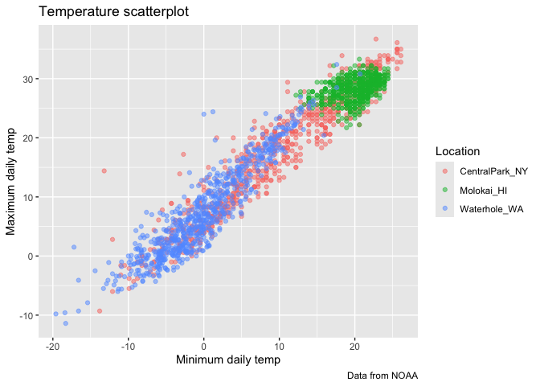
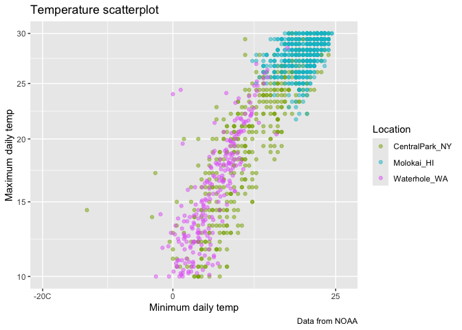

Visualization 2
================

## Bad plots -\> good picture

- show as much of the data as ossible
- avoid superfluous frills like 3D
- Facilitate comparisons, don’t use pie chart cuz ineffective on showing
  proportions
- Principles:
- Be clear on the intent, know your audience, government, co-workers
- 

## Important hotkeys

- command option I to create data chunk
- command+shift+m - pipe operator hotkey
- **highlight command enter**, only highlight the middle part (without
  litters_df and the end bracket) so it outputs the result
- also can put your cursor in the chunk, **command enter**, r is gonna
  run the whole chunk
- press up to run the last piece
- or press up to view

Start loading data (reader is pt of tidyverse)

Import the weather data \* weather data initially collected by NOAA, a
government agency \* climate tries to replace a lot of functionality of
the public data, or go to harvard data library

``` r
data("weather_df")
# precipitation value, T for temperature
```

Making basic scatterplot

``` r
weather_df |> 
  ggplot(aes(x = tmin, y = tmax)) + 
  geom_point(aes(color = name), alpha = 0.5) +
  labs(
    x = "Minimum daily temp",
    y = "Maximum daily temp",
    title = "Temperature scatterplot",
    caption = "Data from NOAA",
    color = "Location"
  )
```

    ## Warning: Removed 17 rows containing missing values or values outside the scale range
    ## (`geom_point()`).

<!-- -->

## Scales

control behavior, how variables are mapped to x axis…

``` r
weather_df |> 
  # filter(tmax >10, tmax <30 ) |> 
  ggplot(aes(x = tmin, y = tmax)) + 
  geom_point(aes(color = name), alpha = 0.5) +
  labs(
    x = "Minimum daily temp",
    y = "Maximum daily temp",
    title = "Temperature scatterplot",
    caption = "Data from NOAA",
    color = "Location"
  ) +
  scale_x_continuous(
    breaks = c(-20,0,25),
    labels = c("-20C","0","25")
  ) +
  scale_y_continuous(
    trans = "sqrt",
    limits = c(10, 30) 
  ) + # zoom in one part of the plot, from 10 to 30 we are interested 
# if we do, filter(tmax >10, tmax <30 ) |> it's similar but this one is data manipulation rather than zoom in 
  scale_color_hue(h = c(100, 300)) # what the colors range between
```

    ## Warning in transformation$transform(x): NaNs produced

    ## Warning in scale_y_continuous(trans = "sqrt", limits = c(10, 30)): sqrt
    ## transformation introduced infinite values.

    ## Warning: Removed 843 rows containing missing values or values outside the scale range
    ## (`geom_point()`).

<!-- -->

on viz2, use`viridis` package, there’s a vriety of color pallet
<https://cran.r-project.org/web/packages/viridis/vignettes/intro-to-viridis.html>

``` r
weather_df |> 
  # filter(tmax >10, tmax <30 ) |> 
  ggplot(aes(x = tmin, y = tmax)) + 
  geom_point(aes(color = name), alpha = 0.5) +
  labs(
    x = "Minimum daily temp",
    y = "Maximum daily temp",
    title = "Temperature scatterplot",
    caption = "Data from NOAA",
    color = "Location"
  ) +
  scale_x_continuous(
    breaks = c(-20,0,25),
    labels = c("-20C","0","25")
  ) + viridis::scale_color_viridis(
    discrete = TRUE
  )
```

    ## Warning: Removed 17 rows containing missing values or values outside the scale range
    ## (`geom_point()`).

<!-- -->
